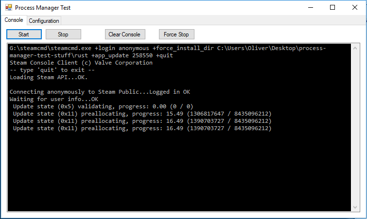
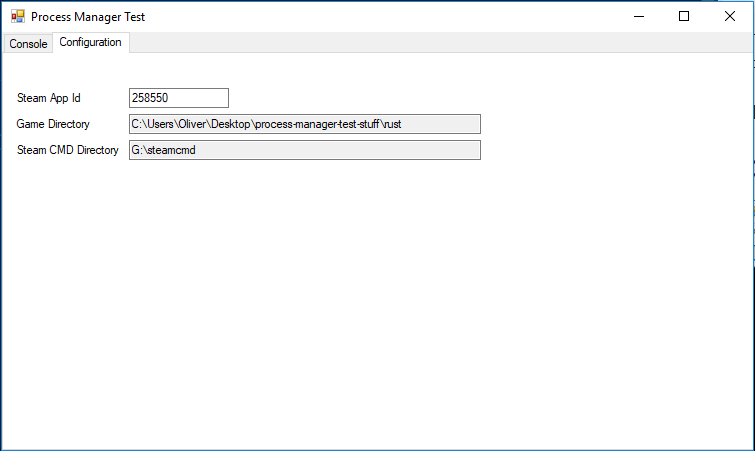

# Process Manager Test

This is a proof of concept application for an upcoming project of mine. This application will allow you to update a Steam app using the SteamCMD.exe tool.

## Interface

### Console Tab

#### Buttons

- Start: Creates a new `Process` class and executes the command to update the specified app
- Stop: Attempts to stop the script using `Process.StandardInput.Close()`

> Note: The Stop button does not appear to stop the SteamCMD.exe. Use the Force Stop button instead.

- Clear Console: Clears any text from the console
- Force Stop: Uses `Process.Kill()` to close the process

### Configuration Tab

#### Inputs

- Steam App Id: Id of the app to download
- Game Directory: Folder to download the app into
- Steam CMD Directory: Folder containing the `steamCMD.exe` file

> Note: Double clicking on the directory text boxes will show the folder selection dialog.